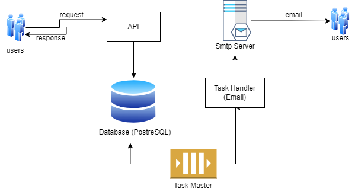

## send-email-api

## Preparation

- Install dependencies

```bash
composer install
```

- Configure the .env file.

## Run Application

```bash
php serve
```

TaskMaster serves as Queue. Run Task Master on another terminal

```bash
php src/TaskMaster.php
```

### Users Api

#### Register

```
  POST /api/users/create
```

| Parameter  | Type     | Description |
| :--------- | :------- | :---------- |
| `username` | `string` | required    |
| `password` | `string` | required    |

#### Login

```
  POST /api/users/login
```

| Parameter  | Type     | Description |
| :--------- | :------- | :---------- |
| `username` | `string` | required    |
| `password` | `string` | required    |

> This api returns Access Token. Will be used for authorization.

### Email Api

#### Send

```
  POST /api/email/send
```

| Parameter   | Type     | Description |
| :---------- | :------- | :---------- |
| `fromEmail` | `string` | required    |
| `fromName`  | `string` | required    |
| `toEmail`   | `string` | required    |
| `toName`    | `string` | required    |
| `subject`   | `string` | required    |
| `body`      | `string` | required    |

> Since this api needs authorization, please also pass Access Token as Bearer Authorization on request header. Access Token can be retrieved from User Login API.

## App Diagram


